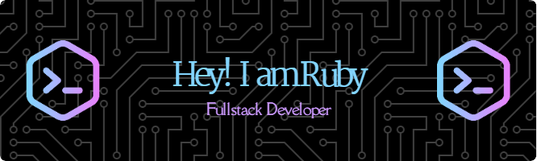

  

### Hi there 👋

- :bowtie: I am an experienced Back-End Developer.
- 🔭 I’m currently working on upgrading my full stack development skills.
- 🌱 I’m currently learning NODE JS, Ruby on Rails, React JS.
- 👯 I’m looking to collaborate on ...
- 🤔 I’m looking for help with ...
- 💬 Ask me about C# and ASP.NET
- 📫 How to reach me: [Chongtham Ruby Devi](https://www.linkedin.com/in/chongtham-bhoomika/)
- 😄 Pronouns: she/her
- ⚡ Fun fact: I am an astrologer too.

<h3 align="left">Connect with me at:</h3>

	
	
	
	
	
	
	
	
	
	
	
	
	
	
	
	
	
	
	
	
	
	
	
	
	
	
	
	

